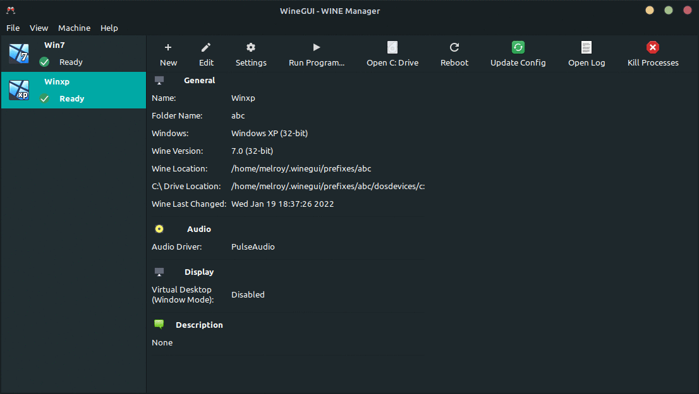

# WineGUI

At last, a user-interface friendly [Wine](https://www.winehq.org/) (A compatibility layer capable of running Windows applications under Linux) Manager.

[](https://gitlab.melroy.org/melroy/winegui/-/pipelines/latest)
[](https://t.me/winegui)
[](https://gitlab.melroy.org/melroy/winegui/-/releases)



## Download

You can find the latest version on the [Releases page](https://gitlab.melroy.org/melroy/winegui/-/releases) of GitLab.

Download the WineGUI package you require for your Linux distribution. I provide `.deb`, `.rpm` and `.tar.gz` files:

- Use the `.deb` package file for Ubuntu, Debian, Linux Mint, Zorin OS, MX linux, and other Debian-based distributions.
- Use the `.rpm` package for Fedora, RHEL, and similar distributions.
- The Compressed Binary `.tar.gz` file is available for manual installation or standalone usage. This is prebuild.
- The Source Code Archive (also `tar.gz`) is intented for building WineGUI from source.

Install the package and you are ready to go! WineGUI should be listed in your menu.

**Run-time requirement:** Wine v9 or higher.

## Features

- **Graphical user-interface** on top of [Wine](https://www.winehq.org/)
- Creating a new machine using an **easy step-by-step wizard**
- **Application list** per machine (with _search feature_ and refresh button)
- Editing, removing and cloning Windows machines _in a breeze_
- Configure window **installing additional software** with just a single click (like installing DirectX)
- **One-button click** to run a program, open the `C:` drive, simulate a reboot or kill all processes

## GitHub Star History

[](https://star-history.com/#winegui/WineGUI&Date)

---

## Contributing

Thank you for considering contributing!

Please, read the dedicated [contributing page](CONTRIBUTING.md).

## Development

### Requirements

WineGUI is created by using [GTK3 toolkit](https://www.gtk.org/) (Gtkmm C++-interface) and C++ code.

Dependencies should be met before build:

- gcc/g++ (advised: v8 or later)
- cmake (advised: v3.10 or later)
- ninja-build
- libgtkmm-3.0-dev (implicit dependency with libgtk-3-dev)
- libjson-glib-dev
- pkg-config

Optionally:

- Ccache (optional, but recommended)
- doxygen
- graphviz
- rpm
- clang-format (v14)
- cppcheck (v2.10 or higher)

**Hint:** You could execute `./scripts/deps.sh` script for Debian based systems (incl. Ubuntu and Linux Mint) in order to get all the dependencies installed automatically.

### Build

Run script: `./scripts/build.sh`

_Or_ execute:

```bash
# Prepare
cmake -GNinja -B build
# Build WineGUI
cmake --build ./build
```

#### Building from source

Building from the source code archive files (eg. `tar.gz`) is just as easy, however be sure to download the **specially prepared** `WineGUI-Source-*.tar.gz` archive file (instead of the GitLab generated source archives).  
This WineGUI source archive contains the `version.txt` meaning the tarball is aware of the project version during the build.

There are various CMake options/variables flags you can set. Use `cmake -LAH` to see all options. For example (release build with `/usr` install prefix):

```bash
cmake -GNinja -B build -DCMAKE_BUILD_TYPE=Release -DCMAKE_INSTALL_PREFIX:PATH=/usr
```

Then execute the build using: `cmake --build ./build` as shown earlier.

### Run

Execute: `ninja -C build run`

Or execute the binary directly:

```sh
./build/bin/winegui
```

### Rebuild

Configuring the Ninja build system via CMake is often only needed once (`cmake -GNinja -B build`), after that just execute:

```bash
cmake --build ./build
```

Or just: `ninja` within the build directory.  
Clean the build via: `ninja clean`.

_Hint:_ Run `ninja help` for all available targets.

### Debug

You can use the helper script: `./scripts/build_debug.sh`

Start debugging in [GDB (GNU Debugger)](https://cs.brown.edu/courses/cs033/docs/guides/gdb.pdf):

```sh
cd build_debug
gdb -ex=run bin/winegui
```

### Production

For production build and DEB file package, you can run: `./scripts/build_prod.sh`

Or use:

```sh
cmake -GNinja -DCMAKE_INSTALL_PREFIX:PATH=/usr -DPACKAGE -DCMAKE_BUILD_TYPE=Release -B build_prod
cmake --build ./build_prod --config Release
cd build_prod
cpack -C Release -G "DEB"
```

### Build Doxygen

Or build with generated doxygen files locally:

```sh
cmake -GNinja -DDOXYGEN=ON -B build_docs
cmake --build ./build_docs --target Doxygen
```

### Documentation

See latest [WineGUI Doxygen webpage](https://gitlab.melroy.org/melroy/winegui/-/jobs/artifacts/main/file/doc/doxygen/index.html?job=test-build).

### Memory check

First build the (Linux) target including _debug symbols_ (see [Debug](#debug) section above). Binary should be present in the `build/bin` directory.

Next, check for memory leaks using `valgrind` by executing:

```sh
./scripts/valgrind.sh
```

Or to generate a memory usage plot in [massif format](https://valgrind.org/docs/manual/ms-manual.html), execute:

```sh
./scripts/valgrind_plot.sh
```

### Releasing

Before you can make a new release, align the version number in WineGUI with the version you want to release.
Then create a new tagged version in Gitlab with the same version name.

_Note:_ Only a `release tag` on the `main` branch will trigger the publish task.

### CI/CD

For continuous integration & delivery we use [our Dockerfile](https://gitlab.melroy.org/melroy/docker-images/-/blob/main/gtk3-cmake-ninja/Dockerfile?ref_type=heads). Also hosted, build and deployed on this GitLab server.

However, the same image (`gtk3-docker-cmake-ninja`) is also shared on [Dockerhub](https://hub.docker.com/r/danger89/gtk3-docker-cmake-ninja).
