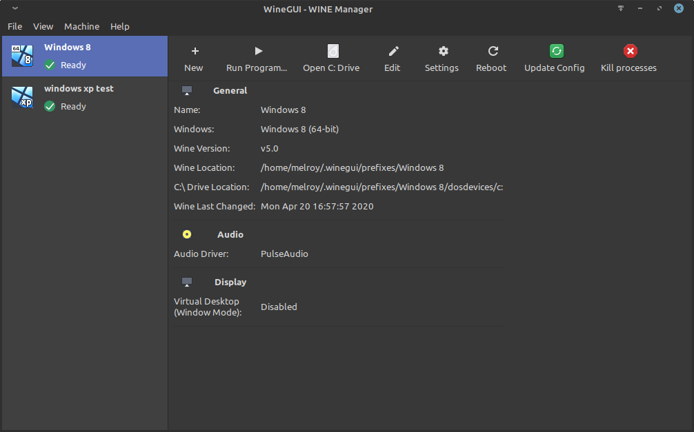

# Wine GUI

Finally, a user-interface friendly [WINE](https://www.winehq.org/) (A compatibility layer capable of running Windows applications under Linux) Manager.



User-interface is created by using GTK+ (gtkmm c++-interface) and C++ code.

## Download

You can find the latest version on the [Releases page](https://gitlab.melroy.org/melroy/winegui/-/releases).

Download the WineGUI package you require for your Linux distribution (we provided `.deb`, `.rpm` and `.tar.gz` files). Typically you should use `.deb` file for Ubuntu and Linux Mint distros.

Install the package and you are ready to go! WineGUI should be listed in your menu.

## Development

Development has been done in Visual Studio Code editor, using the following extensions:

* C/C++
* CMake Tools

* [WineGUI Docs](https://gitlab.melroy.org/melroy/winegui/-/jobs/artifacts/master/file/doc/doxygen/index.html?job=build).

### Requirements

Dependencies should be met before build:

* gcc/g++ (adviced: v7.3 or later)
* cmake (adviced: v3.10 or later)
* ninja-build
* libgtkmm-3.0-dev (implicit dependency with libgtk-3-dev)
* libjson-glib-dev
* pkg-config

Optionally:

* doxygen
* graphviz
* rpm
* cppcheck

**Hint:** You could execute `./scripts/deps.sh` script for Debian based systems (incl. Ubuntu and Linux Mint) in order to get all the dependencies installed automatically.

### Build

Run: `./scripts/build.sh`

Or execute: `mkdir -p build && cd build && cmake -GNinja .. && ninja`

### Run

Execute within the build directory: `ninja run`

Or:

```sh
./build/bin/winegui
```

### Rebuild

Cmake is only needed once, after that you can often use:

`ninja`

Clean the build via: `ninja clean`

*Hint:* Run `ninja help` for all available targets.

### Debug

You can use the helper script: `./scripts/build_debug.sh`

Start debugging in [GDB (GNU Debugger)](https://cs.brown.edu/courses/cs033/docs/guides/gdb.pdf):

```sh
cd build_debug
gdb -ex=run bin/winegui
```

### Production

For production build and DEB file package, you can run: `./scripts/build_prod.sh`

Or use:

```sh
cmake -DCMAKE_BUILD_TYPE=Release
ninja
```

### Doxygen

Open the latest [WineGUI Doxygen page](https://gitlab.melroy.org/melroy/winegui/-/jobs/artifacts/master/file/doc/doxygen/index.html?job=build).

Or build with generated doxygen files locally:

```sh
cmake -GNinja -Ddoc=ON
ninja
```

### Releasing

Before you can make a new release, align the version number in WineGUI with the version you want to release.
Then create a new tagged version in Gitlab with the same version name.

*Note:* Only the `release tag` will trigger the publish task.

## Coding standard

We follow the [Google C++ Style Guide](https://google.github.io/styleguide/cppguide.html).

## CI

For continuous integration we use our [Dockerfile](misc/Dockerfile) to create a Docker image.
This image (`danger89/gtk3-docker-cmake-ninja`) is hosted on [Dockerhub](https://hub.docker.com/r/danger89/gtk3-docker-cmake-ninja).

A helper script can be used: `./scripts/build_and_upload_image.sh`, after successfully identified via `docker login --username=<username>`.

## Coding in the Cloud

### Cloud IDE

You may use our [Cloud IDE](https://ide.melroy.org) for developing remotely.

### How-to develop on a remote server

Execute the following command to copy the binary from the Cloud IDE (Coder) to your local machine & execute WineGUI:

```sh
scp melroy@server.melroy.org:/media/data/coder_projects/project/winegui/build/bin/winegui ~ && ~/winegui
```

*Note #1:* Copy your local ~/.ssh/id_ed25519.pub and add it to the remote machine file: `/home/melroy/.ssh/authorized_keys`
*Note #2:* Requires the `libgtkmm-3.0-1v5` library to be installed on the local machine.
